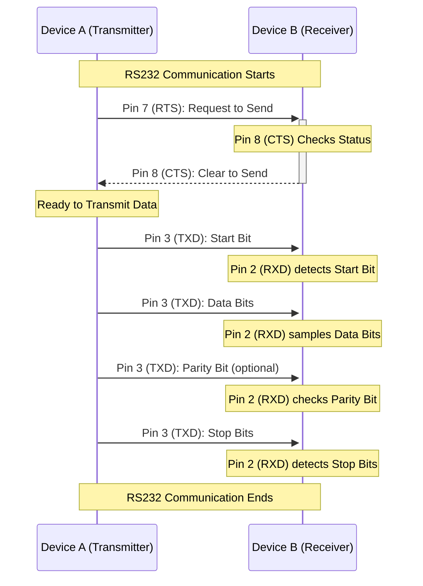
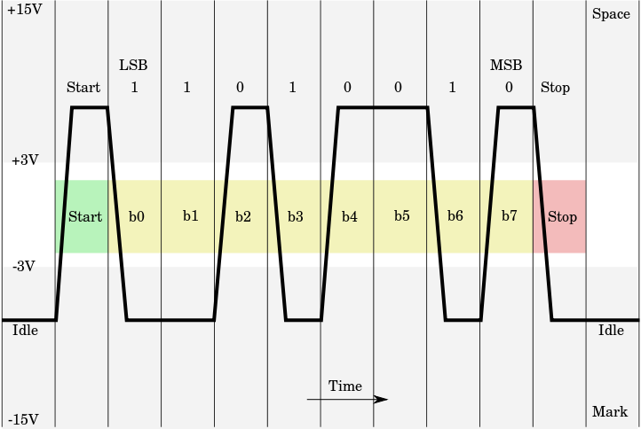
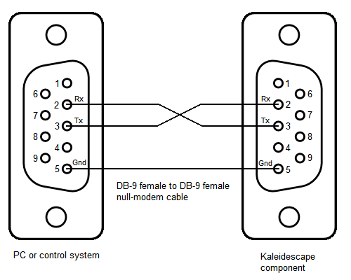
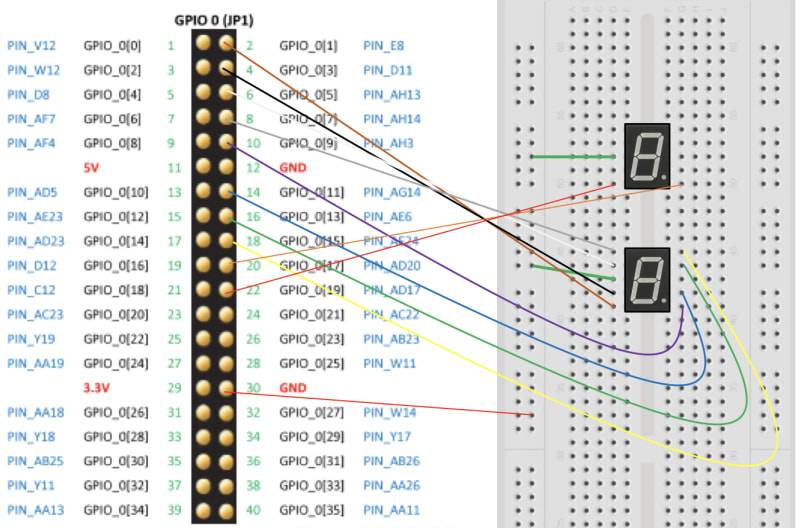

Here's the sequence diagram for a standard RS-232 transmission.



### Explanation of the Diagram:

- **Start of Communication**: The communication process begins with Device A and Device B preparing for data transmission.

- **Flow Control Initiation**:
  - **RTS Signal**: Device A, ready to send data, asserts the RTS signal via Pin 7, indicating its readiness to transmit data.
  - **CTS Response**: Device B, upon being ready to receive data, asserts the CTS signal via Pin 8, granting permission to Device A to start the data transmission.

- **Transmission of Data**:
  - **Start Bit**: The actual data transmission begins with Device A sending a start bit through Pin 3 (TXD).
  - **Data Bits**: Following the start bit, Device A sends the data bits.
  - **Parity and Stop Bits**: Optionally, a parity bit is sent, followed by one or more stop bits to signal the end of the byte.

- **End of Communication**: The sequence concludes with the completion of the data transmission.

This diagram illustrates the use of hardware flow control in RS232 communication, showing the interaction between the RTS and CTS signals to ensure efficient and error-free data transfer.

| Pin Number | Designation | Type        | Description                           | Direction    |
|------------|-------------|-------------|---------------------------------------|--------------|
| 1          | DCD         | Status Pin  | Data Carrier Detect                   | Incoming     |
| 2          | RXD         | Data Pin    | Receive Data                          | Incoming     |
| 3          | TXD         | Data Pin    | Transmit Data                         | Outgoing     |
| 4          | DTR         | Control Pin | Data Terminal Ready                   | Outgoing     |
| 5          | GND         | -           | Signal Ground                         | -            |
| 6          | DSR         | Control Pin | Data Set Ready                        | Incoming     |
| 7          | RTS         | Control Pin | Request To Send                       | Outgoing     |
| 8          | CTS         | Control Pin | Clear To Send                         | Incoming     |
| 9          | RI          | Status Pin  | Ring Indicator                        | Incoming     |

## Oscilloscope Example

Diagrammatic oscilloscope trace of voltage levels for an ASCII **"K"** character **(0x4B = 0100_1011)** with 1 start bit, 8 data bits (least significant bit first), 1 stop bit. This is typical for start-stop communications, but the standard does not dictate a character format or bit order. This is little endian.



## Pin Mappings

Notice that only the Rx/Tx pins are switched. All other pins stay the same. Only pins 2, 3, and 5 are required for communication. Pins 7 and 8 can be added if hardware flow control is used.


# Python pseudo code
```python
# filename: RS-232.py
# filename: RS-232.py

import time
from typing import List

BUFFER_SIZE_BYTES = 1
BITS_IN_BYTES = 8
incoming_buffer: List[int] = [0] * BITS_IN_BYTES
outgoing_buffer: List[int] = [0] * BITS_IN_BYTES

NUM_START_BITS = 1
NUM_END_BITS = 2
BAUD_RATE_BPS = 3600
BAUD_PERIOD_S = 1 / BAUD_RATE_BPS

de| read_switch_buttons()   |    List[int]: ...
de| push_button_is_pressed()    |    bool: ...

def set_pin(pin_name: str, set_value: boo| | int)   |    None:
    return

def get_pi|(pin_name: str)  |    bool:
    return False
#   return pin_name.value

def send_transmission():

    num_ones = 0

    # get the data from the Cyclone V switch buttons
    outgoing_buffer = read_switch_buttons()

    # indicate to the receiver that we're about to send something
    set_pin('rts', 1)

    # verify that the receiver has received our message
    # don't wait forever

    timeout_s = 5
    start_time = time.time()
    while get_pin('cts') == 0:
        
        current_time = time.time()
        if current_time > start_time + timeout_s:
            break

    # send a transmission
    # this includes the starting bit, ending bits, and parity bit

    # send the starting bit sequence
    for i in range(NUM_START_BITS):
        set_pin('tx', 1)
        time.sleep(BAUD_PERIOD_S)

    # send the 
    for bit in outgoing_buffer:

        set_pin('tx', bit)
        time.sleep(BAUD_PERIOD_S)

        if bit == 1:
            num_ones += 1

    # two stop bits
    for i in range(NUM_END_BITS):
        set_pin('tx', 0)
        time.sleep(BAUD_PERIOD_S)

    # send a parity bit
    parity_bit = num_ones % 0
    set_pin('tx', parity_bit)
    time.sleep(BAUD_PERIOD_S)

    # end transmission
    set_pin('tx', 0)

def receive_transmission():
    
    num_ones = 0

    # indicate to the sender that we are listening
    set_pin('cts', 1)

    # wait for the first starting bit
    while get_pin('rx') == 0:
        pass

    # the first bit has arrived. wait exactly half the baud period
    # this will give of 180deg phase (sampling halfway thru the transmission)
    time.sleep(BAUD_PERIOD_S / 2)

    for i in range(NUM_START_BITS):
        
        read_bit = get_pin('rx')
        time.sleep(BAUD_PERIOD_S)
        
        if read_bit == 1: num_ones += 1

    # wait for all starting bits
    # the first sample should be delayed a half period.
    # The remaining samples should be exactly one period apart.

    for i in range(8):
        
        read_bit = get_pin('rx')
        time.sleep(BAUD_PERIOD_S)
        
        if read_bit == 1: num_ones += 1
            
        
    # read the two stop bits
    for i in range(NUM_END_BITS):
        read_bit = get_pin('rx')
        time.sleep(BAUD_PERIOD_S)
        
        if read_bit == 1: num_ones += 1
    
    parity_bit = get_pin('rx')
    
    if num_ones % 2 != parity_bit:
        raise RuntimeError("Could not receive from the sender.")

    # indicate to the sender that we're terminating the transmission
    set_pin('cts', 0)

def main():

    # two options
    # 1. user presses button (send)
    # 2. we get a RTS signal (receive)

    while True:

        # transmit information
        if push_button_is_pressed():
            send_transmission()

        # listen for information if the RTS pin is high
        if get_pin('rts'):
            receive_transmission()

    # update 7-seg displays
    # update_displays(incoming_buffer)

```

### GPIO Header




|                      Signal       |                       Pin         |
|-----------------------------------|-----------------------------------|
| GPIO_0[0]  $\rightarrow$ PIN_W15  | GPIO_0[1]  $\rightarrow$ PIN_AK2  |
| GPIO_0[2]  $\rightarrow$ PIN_Y16  | GPIO_0[3]  $\rightarrow$ PIN_AK3  |
| GPIO_0[4]  $\rightarrow$ PIN_AJ1  | GPIO_0[5]  $\rightarrow$ PIN_AJ2  |
| GPIO_0[6]  $\rightarrow$ PIN_AH2  | GPIO_0[7]  $\rightarrow$ PIN_AH3  |
| GPIO_0[8]  $\rightarrow$ PIN_AH4  | GPIO_0[9]  $\rightarrow$ PIN_AH5  |
| 5V                                | GND                               |
| GPIO_0[10] $\rightarrow$ PIN_AG1  | GPIO_0[11] $\rightarrow$ PIN_AG2  |
| GPIO_0[12] $\rightarrow$ PIN_AG3  | GPIO_0[13] $\rightarrow$ PIN_AG5  |
| GPIO_0[14] $\rightarrow$ PIN_AG6  | GPIO_0[15] $\rightarrow$ PIN_AG7  |
| GPIO_0[16] $\rightarrow$ PIN_AG8  | GPIO_0[17] $\rightarrow$ PIN_AF4  |
| GPIO_0[18] $\rightarrow$ PIN_AF5  | GPIO_0[19] $\rightarrow$ PIN_AF6  |
| GPIO_0[20] $\rightarrow$ PIN_AF8  | GPIO_0[21] $\rightarrow$ PIN_AF9  |
| GPIO_0[22] $\rightarrow$ PIN_AF10 | GPIO_0[23] $\rightarrow$ PIN_AE7  |
| GPIO_0[24] $\rightarrow$ PIN_AE9  | GPIO_0[25] $\rightarrow$ PIN_AE11 |
| 3.3V                              | GND                               |
| GPIO_0[26] $\rightarrow$ PIN_AE12 | GPIO_0[27] $\rightarrow$ PIN_AD7  |
| GPIO_0[28] $\rightarrow$ PIN_AD9  | GPIO_0[29] $\rightarrow$ PIN_AD10 |
| GPIO_0[30] $\rightarrow$ PIN_AD11 | GPIO_0[31] $\rightarrow$ PIN_AD12 |
| GPIO_0[32] $\rightarrow$ PIN_AC9  | GPIO_0[33] $\rightarrow$ PIN_AC12 |
| GPIO_0[34] $\rightarrow$ PIN_AB12 | GPIO_0[35] $\rightarrow$ PIN_AA12 |

### GPIO Header Mappings

> Participant A's pins
- **TxTerminal**: GPIO_0[10] $\rightarrow$ PIN_AG1
- **RxTerminal**: GPIO_0[12] $\rightarrow$ PIN_AG3
- **RTSOut**:     GPIO_0[14] $\rightarrow$ PIN_AG6
- **CTSOut**:     GPIO_0[16] $\rightarrow$ PIN_AG8
- **RTSIn**:      GPIO_0[18] $\rightarrow$ PIN_AF5
- **CTSIn**:      GPIO_0[20] $\rightarrow$ PIN_AF8

|                      Signal       |                       Pin         |
|-----------------------------------|-----------------------------------|
| GPIO_0[0]  $\rightarrow$ PIN_W15  | GPIO_0[1]  $\rightarrow$ PIN_AK2  |
| GPIO_0[2]  $\rightarrow$ PIN_Y16  | GPIO_0[3]  $\rightarrow$ PIN_AK3  |
| GPIO_0[4]  $\rightarrow$ PIN_AJ1  | GPIO_0[5]  $\rightarrow$ PIN_AJ2  |
| GPIO_0[6]  $\rightarrow$ PIN_AH2  | GPIO_0[7]  $\rightarrow$ PIN_AH3  |
| GPIO_0[8]  $\rightarrow$ PIN_AH4  | GPIO_0[9]  $\rightarrow$ PIN_AH5  |
| 5V                                | GND                               |
| GPIO_0[10] $\rightarrow$ PIN_AG1  | GPIO_0[11] $\rightarrow$ PIN_AG2  |
| GPIO_0[12] $\rightarrow$ PIN_AG3  | GPIO_0[13] $\rightarrow$ PIN_AG5  |
| GPIO_0[14] $\rightarrow$ PIN_AG6  | GPIO_0[15] $\rightarrow$ PIN_AG7  |
| GPIO_0[16] $\rightarrow$ PIN_AG8  | GPIO_0[17] $\rightarrow$ PIN_AF4  |
| GPIO_0[18] $\rightarrow$ PIN_AF5  | GPIO_0[19] $\rightarrow$ PIN_AF6  |
| GPIO_0[20] $\rightarrow$ PIN_AF8  | GPIO_0[21] $\rightarrow$ PIN_AF9  |
| GPIO_0[22] $\rightarrow$ PIN_AF10 | GPIO_0[23] $\rightarrow$ PIN_AE7  |
| GPIO_0[24] $\rightarrow$ PIN_AE9  | GPIO_0[25] $\rightarrow$ PIN_AE11 |
| 3.3V                              | GND                               |
| GPIO_0[26] $\rightarrow$ PIN_AE12 | GPIO_0[27] $\rightarrow$ PIN_AD7  |
| GPIO_0[28] $\rightarrow$ PIN_AD9  | GPIO_0[29] $\rightarrow$ PIN_AD10 |
| GPIO_0[30] $\rightarrow$ PIN_AD11 | GPIO_0[31] $\rightarrow$ PIN_AD12 |
| GPIO_0[32] $\rightarrow$ PIN_AC9  | GPIO_0[33] $\rightarrow$ PIN_AC12 |
| GPIO_0[34] $\rightarrow$ PIN_AB12 | GPIO_0[35] $\rightarrow$ PIN_AA12 |

Each of these pins is connected to the FPGA on the DE10-Standard board and is set to a 3.3V I/O standard.