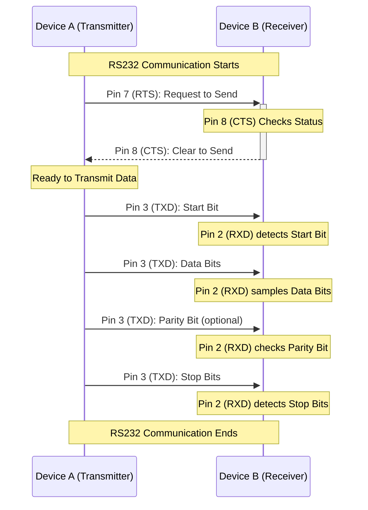

Here's the sequence diagram for a standard RS-232 transmission.

### Explanation of the Diagram:

- **Start of Communication**: The communication process begins with Device A and Device B preparing for data transmission.

- **Flow Control Initiation**:
  - **RTS Signal**: Device A, ready to send data, asserts the RTS signal via Pin 7, indicating its readiness to transmit data.
  - **CTS Response**: Device B, upon being ready to receive data, asserts the CTS signal via Pin 8, granting permission to Device A to start the data transmission.

- **Transmission of Data**:
  - **Start Bit**: The actual data transmission begins with Device A sending a start bit through Pin 3 (TXD).
  - **Data Bits**: Following the start bit, Device A sends the data bits.
  - **Parity and Stop Bits**: Optionally, a parity bit is sent, followed by one or more stop bits to signal the end of the byte.

- **End of Communication**: The sequence concludes with the completion of the data transmission.

This diagram illustrates the use of hardware flow control in RS232 communication, showing the interaction between the RTS and CTS signals to ensure efficient and error-free data transfer.

| Pin Number | Designation | Type        | Description                           |
|------------|-------------|-------------|---------------------------------------|
| 1          | DCD         | Status Pin  | Data Carrier Detect                   |
| 2          | RXD         | Data Pin    | Receive Data                          |
| 3          | TXD         | Data Pin    | Transmit Data                         |
| 4          | DTR         | Control Pin | Data Terminal Ready                   |
| 5          | GND         | -           | Signal Ground                         |
| 6          | DSR         | Control Pin | Data Set Ready                        |
| 7          | RTS         | Control Pin | Request To Send                       |
| 8          | CTS         | Control Pin | Clear To Send                         |
| 9          | RI          | Status Pin  | Ring Indicator                        |

## Oscilloscope Example

Diagrammatic oscilloscope trace of voltage levels for an ASCII **"K"** character **(0x4B = 0100_1011)** with 1 start bit, 8 data bits (least significant bit first), 1 stop bit. This is typical for start-stop communications, but the standard does not dictate a character format or bit order. This is little endian.

